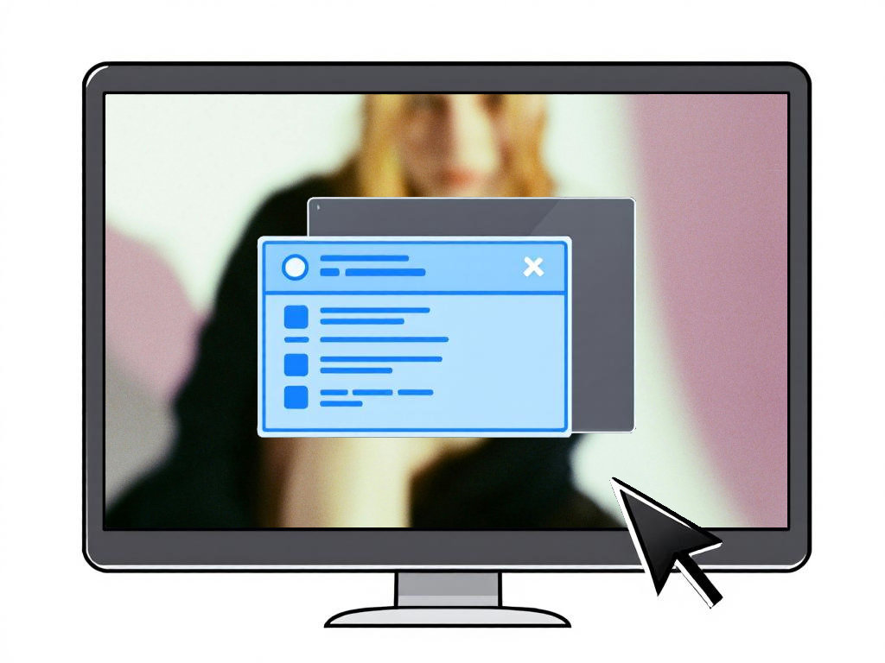

# Slideoutbox

A Joomla! module for displaying a customizable slideout box that appears when users scroll to a specified page depth.

Want to engage your website visitors with a call-to-action or promotional content? Slideoutbox lets you display a sleek popup box triggered by scroll depth, perfect for capturing attention and driving conversions.

This is your first step to turning passive website visitors into engaged users who interact with your offers. The idea was to create one of those container divs you see to log into a third party service.

## How To Use Slideoutbox
1. Install the module via the Joomla! Extensions Manager. You can install via URL by using this direct link: [https://github.com/brettvac/slideoutbox/releases/latest/download/mod_slideoutbox.zip](https://github.com/brettvac/slideoutbox/releases/latest/download/mod_slideoutbox.zip)
2. Navigate to Content > Modules and find "Slideoutbox".
3. Configure the module settings, including scroll depth (e.g., 50%), heading tag (h1-h6), main text, button URL, and cookie expiration (days).
4. Publish the module in the `footer` position. The slideout will appear when users scroll to the set depth.

## Features
- **Supports Prepared Content**: You can enable content preparation and show Joomla plugins inside the box.
- **Customizable Content**: Configure heading (h1-h6), main text, and optional button with URL.
- **Cookie Persistence**: Remembers closed state with a module-specific cookie to prevent reappearance.
- **Responsive Design**: Adapts to mobile devices with smaller screens.

## Requirements
This module works with Joomla! versions greater than 4.4 and requires PHP 7.2.5 or later.
No external accounts or APIs are needed, just a Joomla installation.

## FAQ
**Q: Can I display multiple slideout boxes on one page?**  
**A:** Currently, the module supports one slideout per page. Multi-instance support may be added in a future update.

**Q: Why is the module ID used in the cookie name?**  
**A:** The module ID ensures unique cookies (e.g., `mod_slideoutbox_closed_<moduleId>`) to avoid conflicts, even for a single instance.

**Q: This plugin is awesome! Can I send a donation?**  
**A:** Sure! Send your cryptonation to the following wallets:

`BTC 1PXWZJcBfehqgV25zWdVDS6RF2yVMxFkZD`

`Eth 0xC9b695D4712645Ba178B4316154621B284e2783D`

**Q: Got any more awesome Joomla! plugins?**  
**A:** Find them [right here](https://naftee.com)